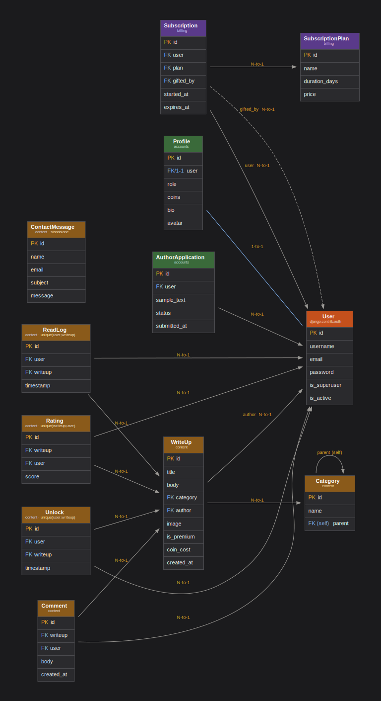

# RootCause - `/cause`

### A knowledge - sharing platform for security WriteUps

**Live site:** https://pgkinala.pythonanywhere.com

**Github** https://github.com/Deyonna/rootcause

**Tech stack:** Django 5.2, SQLite, Bootstrap 5.3, jQuery 3.7, markdown-it-py, Pillow, python-decouple. Deployed on PythonAnywhere.

**Course:** ITC4214 - Final Project

`/cause` (read "root cause") is a curated platform where **vetted authors** publish cybersecurity write- ups and CTF walkthroughs. Readers browse and read freely, **earn coins** by reading, and **spend those coins** to unlock premium writeups, or buy a **subscription** (simulated real - money purchase) that unlocks everything.

--- 

## Table of Contents

1. [How the website works](#1-how-the-website-works)
2. [How the Specifications are Satisfied](#2-how-the-specifications-are-satisfied)
3. [Types of Users](#3-types-of-users)
4. [Project Structure - Apps](#4-project-structure-apps)
5. [Pages & Coding Decisions](#5-pages--coding-decisions)
6. [Entity-Relationship Diagram](#6-entity-relationship-diagram)
7. [Deployment](#7-deployment)
8. [Running Locally](#8-running-locally)

--- 

## 1. How the website works

`/cause` is a publishing platform supporting subscriptions and credits in the cybersecurity education field.

- **Authors** are vetted, a reader must apply with a writing sample and be approved by an admin before they can publish. This keeps quality high among the writeups.
- **Readers** engage with free content to earn an in- app currency (coins), which they spend to unlock premium write - ups.
- **Revenue** comes from real - money subscriptions (simulated here), which grant blanket access to all premium content for their duration.

---

## 2. How the Specifications are Satisfied

### 2.1 - Browsable Writeups

`Category` is a self - referencing model (`parent` FK to itself), giving unlimited - depth category trees. The catalogue (`writeup_list` view) lets users browse all write - ups, and selecting a parent category shows write - ups from it and all its descendants (`Category.get_descendant_ids()` walks the tree recursively). The category dropdown is rendered hierarchically with indentation (`Category.sort_hierarchically()`).

### 2.2 - Search by name + another characteristic + advanced filtering

- **Search by name:** case - insensitive title search (`title__icontains`).
- **Search by category** users filter by any category/sub - category.
- **Price range filter (min/max)** plus a **premium- only** toggle and a **sort** control (recent / alphabetical).

### 2.3 - Registration, login/logout, profile view/edit, personalized dashboard

- Registration uses Django's `UserCreationForm` (extended for email uniqueness), with login/logout via Django's built - in auth views.
- Logged - in users view and edit their profile (username, first/last name, email, bio, avatar image).
- The **personalized dashboard** shows: current coin balance, count of free write- ups read, count of premium write - ups unlocked, and lists of **recently read** and **recently unlocked** write - ups (driven by the `ReadLog` and `Unlock` models). Authors get an additional dashboard variant with a link to manage their own write- ups.

### 2.4 - Administrators manage catalogue, categories, and users

A **custom admin panel** lets superusers:
- CRUD write - ups (including **image uploads**), categories, and subscription plans,
- manage users (view detail, toggle author/reader role, activate/deactivate, delete),
- review and approve/reject author applications,
- read contact - form messages,
- see dashboard stats (users, revenue, coin supply, pending applications).

### 2.5 - Role-based security (Admin / User), public users blocked from member/admin pages

Three roles (Admin, Author, Reader) enforced server-side:
- `@login_required` gates member-only pages,
- `@author_required` gates author-only pages (publishing),
- `@admin_required` gates every single admin-panel view (checks `is_superuser`).
Non-privileged users are redirected, and admin links are hidden from the UI for non-admins. Ownership checks (`get_object_or_404(WriteUp, pk=pk, author=request.user)`) stop an author editing another author's content (IDOR protection).

### 2.6 - Security

| Threat | How it's handled |
|--------|------------------|
| **SQL injection** | All DB access goes through Django's ORM, which parameterizes queries. No raw SQL, no string-formatted queries anywhere. |
| **XSS (cross-site scripting)** | Django template auto-escaping is on by default. The one place raw HTML is emitted is the markdown renderer but it is configured with `html=False` (in `markdown_extras.py`), which **escapes** any literal `<script>` in a write-up body instead of passing it through, so `mark_safe()` can't become a stored-XSS trap. |
| **CSRF** | Django's CSRF middleware is enabled so every POST form carries ``, and the AJAX call sends the token explicitly. Actions like (logout, unlock, checkout, rating, delete) are POST-only. |
| **IDOR (insecure direct object reference)** | Object queries are scoped to the requesting user where ownership matters e.g. `get_object_or_404(WriteUp, pk=pk, author=request.user)` returns 404 (not another user's data) if you try to edit content you don't own. |
| **Broken access control** | Three layers of decorators (`@login_required`, `@author_required`, `@admin_required`) enforce role on the server for every protected view and admin/author checks are re-verified in the view. |
| **Password security** | Django's four password validators are active (min length, common-password, numeric-only, and user-attribute-similarity checks). Passwords are hashed by Django (PBKDF2), never stored in plaintext. |
| **Registration integrity** | Email uniqueness is enforced at registration (`clean_email`), preventing duplicate-account confusion for gift subscriptions. |
| **Spam** | The contact form has a hidden **honeypot** field so that submissions that fill it are silently discarded (bot activity). |
| **Secrets** | `SECRET_KEY`, `DEBUG`, and `ALLOWED_HOSTS` are read from environment variables via `python-decouple`, not hardcoded. The production server uses `DEBUG=False` so no trace is leaked upon errors. |

### 2.7 - Recommender system
The `writeup_detail` view recommends up to 4 related write-ups. Write-ups from the same category branch meaning that recommendations include sibling sub-categories, not just an exact category match, excluding the current write-up.

### 2.8 - Ratings via AJAX
A 1–5 **star rating** widget submits via **AJAX (jQuery)** to a JSON endpoint so there is no page reload. The endpoint returns the updated average and count, which the page displays instantly. It's `@login_required`, enforces access, and `update_or_create` lets a user change their rating without creating duplicates (backed by a `unique_together` constraint).

### 2.9 - Shopping cart simulating a purchase
A session-based cart holds subscription plans (including **gift** subscriptions sent to another user by email). Checkout **simulates payment** and it creates `Subscription` records as if payment succeeded, with no real gateway. Subscription gifts are valid if the email exists else it is assumed that the new user receives an email with the invitation (not implemented).

---

## 3. Types of Users

| Role | How you become one | Can do |
|------|-------------------|--------|
| **Reader** | Default on registration | Browse, search, filter, read free write-ups (earn coins), unlock premium with coins, buy subscriptions, rate, comment, apply to be an author, edit own profile |
| **Author** | Apply with a sample form then admin approves | Everything a Reader can, **plus** create/edit/delete their own write-ups |
| **Admin** (superuser) | Created via `createsuperuser` | Full custom admin panel: manage all content, categories, users, plans, applications, and messages |

Role is stored on the `Profile` model (`role` field) except for Admin, which uses Django's built-in `is_superuser` flag. A Django **signal** (`post_save` on `User`) auto-creates a `Profile` for every new user, so the two are always in sync.

---
## 4. Project Structure - Apps

The project is split into three Django apps by **business domain*:

- **`accounts`** - identity: `Profile`, `AuthorApplication`, registration/login, profiles, dashboards, and the custom admin panel. *authentication, authorization*
- **`content`** - the write-ups domain: `Category`, `WriteUp`, `Rating`, `ReadLog`, `Unlock`, `Comment`, `ContactMessage`, plus browsing, search, cart, and authoring. *"Everything concerning the writeups themselves"*
- **`billing`** - money: `SubscriptionPlan`, `Subscription`. *"Paid subscription plans and purchases."* Kept separate because it's priced in real currency (simulated).

Cross-app imports are one-directional (e.g. `content.utils.has_access` imports `billing.Subscription` to check subscription-based access).

---

## 5. Pages & Coding Decisions

| Page | Route | Notes |
|------|-------|-------|
| Browse | `/` | Search + filter + sort, Bootstrap card grid |
| Write-up detail | `/writeup/<id>/` | Login-required, markdown-rendered body, AJAX rating, comments, recommender sidebar premium unlock gate |
| Register / Login | `/accounts/register/`, `/accounts/login/` | Django auth + email-uniqueness validation |
| Dashboard | `/accounts/dashboard/` | Role-branched reader-author, recent activity from `ReadLog`/`Unlock` |
| Edit profile | `/accounts/profile/edit/` | Two forms (User + Profile) saved together, avatar upload |
| Apply to be author | `/accounts/apply-author/` | Guards against duplicate pending applications |
| My write-ups (author) | `/my-writeups/` | Author-only - create/edit/delete own content |
| Subscriptions | `/subscriptions/` | Plans priced in $, gift option |
| Cart / Checkout | `/cart/`, `/cart/checkout/` | Session cart with simulated purchases |
| Custom admin dashboard | `/accounts/admin/...` | Superuser-only full custom management panel |
| Contact | `/contact/` | Honeypot-protected from bots since it is available to non logged in users |
| About | `/about/` | Static informational page regarding the website |
| 404 | (any bad URL) | Custom error page |

**Base template + inheritance:** every page extends `base.html`, which holds the responsive collapsible navbar, message alerts, footer, and shared `<head>`/scripts. Page templates only define their ``.

**Bootstrap form styling via a mixin:** rather than hand-adding `class="form-control"` to a lot of fields, `BootstrapFormMixin` applies the right Bootstrap class to every field automatically.

**`content/utils.py` → `has_access(user, writeup)`.** Centralizes the "can this user see this premium content?" rule (free? own authorship? unlocked with coins? active subscription?). Three different views (detail, rating, comment) need the same check so putting it in one function avoids repetitions.

**`content/templatetags/markdown_extras.py` -> `render_markdown` filter.** A custom template filter that renders write-up bodies from Markdown to HTML. This lets authors write formatted content (headings, code blocks) instead of raw HTML. Deliberately configured `html=False` for XSS safety.

**`accounts/decorators.py` / `content/decorators.py` -> `@admin_required`, `@author_required`.** Thin wrappers over Django's `user_passes_test`. *Justification:* readable, reusable role gates that read like intent (`@author_required` above a view) instead of repeating a lambda everywhere.

**`Category.sort_hierarchically()` / `get_descendant_ids()`.** Static/instance helpers that flatten the self-referencing category tree for display and for descendant-inclusive filtering. A self-referencing FK is the standard way to model sub-categories.

JavaScript is used **only where a page reload would hurt UX**, never for core logic (all business rules are server-side).

1. **`writeup_detail.html` (inline) — AJAX star rating.** jQuery `$.ajax()` POSTs the score and updates the average/count in place.
2. **`markdown-toolbar.js` - author editor toolbar.** Adds bold/italic/code/link buttons to the write-up body textarea for convinience.
3. **`premium-toggle.js` - show/hide coin-cost field.** When "premium" is unchecked, the coin-cost input is hidden. Crucially, this is backed server-side - `WriteUpForm.clean()` forces `coin_cost = 0` when not premium, so the JS is just for UX reasons.
4. **`contact.js` - live form validation.** Adds red/green field feedback on blur/submit. Django re-validates everything server-side regardless so it is purely for the UX.

---

## 6. Entity-Relationship Diagram



- **1-to-1:** `User ↔ Profile`
- **1-to-many:** `User → WriteUp` (author), `Category → WriteUp`, `WriteUp → Rating/ReadLog/Unlock/Comment`, `SubscriptionPlan → Subscription`, plus every user-activity table back to `User`.
- **Self-referencing:** `Category → Category` (parent), enabling sub-categories.
- **Junction tables with extra data:** `Rating`, `ReadLog`, `Unlock` each connect a `User` and a `WriteUp` with a `unique_together` constraint (so a user can't rate/read/unlock the same write-up twice).

---

## 7. Deployment

PythonAnywhere was chosen over alternatives for one reason: its free tier provides **persistent disk storage**. Because this project uses **SQLite** (a file on disk) and stores **user-uploaded images** (avatars and write-up images) in a `media/` folder, both need to survive between requests and redeploys.

The same codebase runs locally and in production and the environment differences are handled entirely through environment variables (`python-decouple`). The production `.env` lives only on the server's filesystem it is never committed to git so the real secret key is never exposed in the repo.

With `DEBUG=False`, Django no longer serves static or media files itself, so PythonAnywhere is configured with two static-file mappings:

| URL prefix | Server directory | Serves |
|-----------|------------------|--------|
| `/static/` | `.../rootcause/staticfiles` | CSS, JS, images (from `collectstatic`) |
| `/media/` | `.../rootcause/media` | User-uploaded avatars and write-up images |

`python manage.py collectstatic` gathers every static file into `staticfiles/` for PythonAnywhere to serve directly off disk.

---

## 8. Running Locally

```bash
git clone https://github.com/Deyonna/rootcause.git
cd rootcause
python -m venv venv
source venv/bin/activate      # Windows: venv\Scripts\activate
pip install -r requirements.txt
```

Create a `.env` file in the project root:

```
SECRET_KEY=generate-a-key (python -c "import secrets; print(secrets.token_urlsafe(50))")
DEBUG=True
ALLOWED_HOSTS=127.0.0.1,localhost
```

Then:

```bash
python manage.py migrate
python manage.py createsuperuser
python manage.py runserver
```

Visit `http://127.0.0.1:8000/`.

